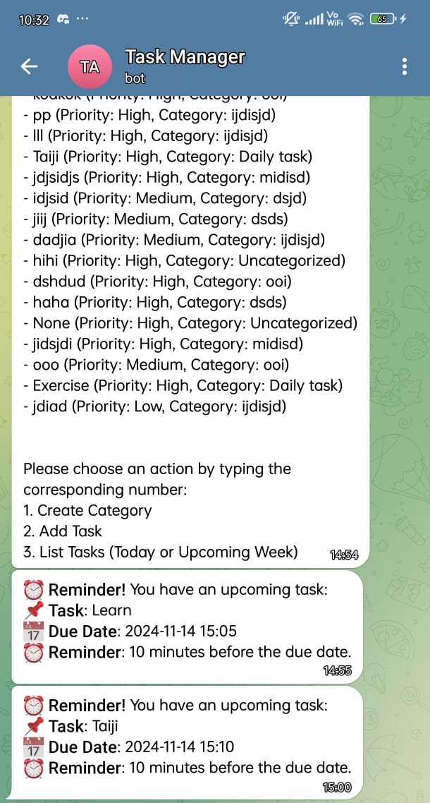

    
    <h2>📝 Personal Assist Task Management System</h2>
    <h3>With NLP & Telegram Bot Integration</h3>

---

## 🎯 Problem Statement

Task management tools lack integration and NLP features, causing disjointed workflows and reduced efficiency. Teams need a unified solution with real-time collaboration, automated task extraction, and intelligent suggestions to enhance productivity.

---

## 📝 Objectives

1. Conduct a **comprehensive literature review**.
2. Develop a **mobile task management system**.
3. Integrate **NLP capabilities and Telegram bot** for seamless task management.
4. Ensure **usability and user acceptance** through feedback and testing.

---

## ✨ System Features

- **Time Tracking and Reporting:** Monitor task progress and productivity.
- **Task Management:** Create, update, prioritize, and delete tasks.
- **Calendar Integration:** Visualize task deadlines and events.
- **AI-Powered Features:** Use NLP for task extraction, prioritization, and intelligent suggestions.
- **Telegram Integration:** Sync tasks between the app and Telegram for real-time updates and notifications.

---

## 📊 System Strengths

- **Integration:** Syncs the mobile app with Telegram for seamless task management.
- **Efficiency:** Automatically extracts and prioritizes tasks using NLP.
- **User-Friendly:** Simplifies task creation, updates, and reminders.
- **Collaboration:** Supports group tasks and progress tracking.
- **Security:** Ensures data protection during interactions.
- **Customizability:** Allows users to tailor notifications and task settings.

---

## 📸 Screenshots from the System

### Mobile App

- **Home Page:** Overview of tasks and categories.
- **Task Page:** Create and manage individual tasks.
- **Calendar:** View tasks and events by date.

### Telegram Integration

- **List Tasks:** Display tasks by priority and deadlines.
- **Task Reminder:** Send automated task reminders.
- **Task Creation:** Create tasks directly via Telegram commands.

    
    
    
    
    
    

---

## 🙏 Acknowledgements

Thank you, **Ms. Yap Choi Sen**, for your guidance and support on this project. Also, appreciation to **INTI International University** and my friends for their help and feedback in testing the system.

---

**Author:**  
Teoh Jia Liang  
**FYP Code:** FYP4202  
📞 **Contact:** 0167195828  
📧 **Email:** [jialiang5489@gmail.com](mailto:jialiang5489@gmail.com)

---

